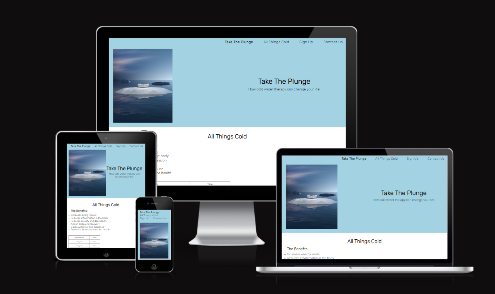
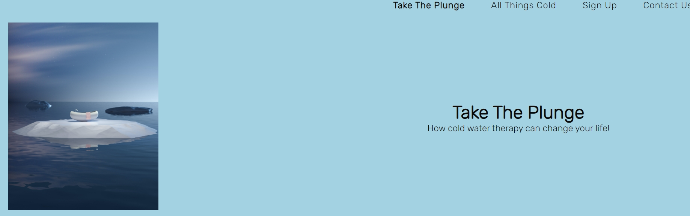
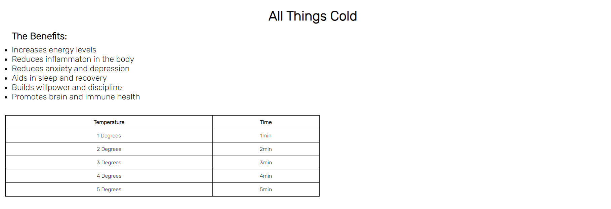
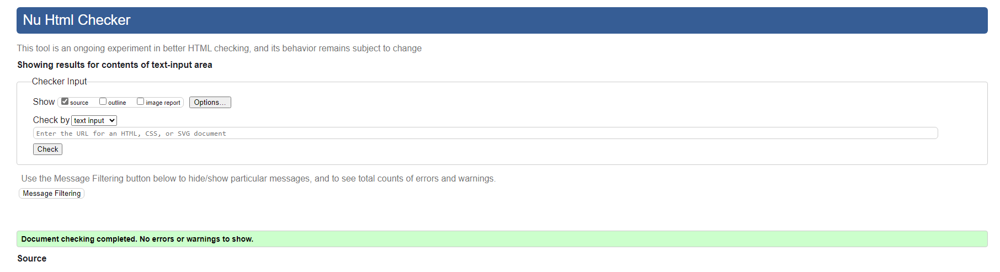
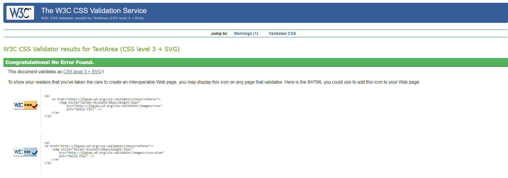
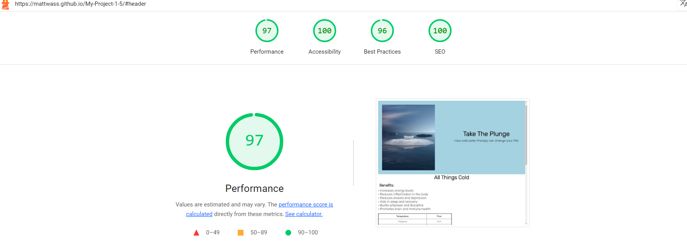

# Take The Plunge

Take The Plunge is a website designed to help people understand the incredible benefits of cold water therapy. It does this by listing ways in which these benefits may better improve people's lives. Helping them heal from various inflammatory issues as well as aid in the balancing of hormones and energy levels.

Exceptions apply where an individual has medical conditions (cardiac, pulmonary, etc). In such conditions people should seek advice via relevant health care providers before participating in cold water immersion. 

Another exception is age. Generally speaking children do not tolerate cold water therapy as well as adults and can run into danger quicker. Therefore, it is recommended that cold water therapy be avoided by children.

This is a one page website with three separate sections. Those being an information section called All Things Cold. A Sign Up section, to sign up and participate in cold water immersion. Then a Contact Us section. So anyone can get in touch with any queries they may have in regards to cold water therapy.

The colours for this page are light blue and white. These colours are in line with the theme of water, ice and snow.

Welcome to [Take The Plunge](https://mattwass.github.io/My-Project-1-5/)

## Features
- Navigation

  - At the top of the page we can see the main site heading alongside the various links to the other sections of the webpage. These include All Things Cold, Sign Up and Contact Us.
  - The navigation of the webpage outlines the different sections clearly and displays the relevant sections appropriately.
  - The image displays a bath in the middle of a ice block, on top of a body of water.

  

- All Things Cold
  - The All Things Cold section displays the various benefits of cold water exposure.
  - This section also hosts a table which displays the required time to spend exposed to the cold water depending on what the temperature is.

- Sign Up
  - The Sign Up section hosts a form which includes a required email and password. 
  - Users can sign up to take part in cold water therapy through Take The Plunge.

- Contact Us
  - The Contact Us section offers and email address for direct contact with Take The Plunge.
  - This section also houses Take The Plunge's various social media sites. These include:
    - Facebook
    - Instagram
    - Twitter / X
    - Youtube
  
  

## Testing
- I have tested that the webpage works in different browsers: 
  - Microsoft Edge
  - Google Chrome
  - Mozilla Firefox

- I can confirm that the webpage is responsive on various screen sizes, using the devtools device toolbar. I tested this with an iphone 12 pro in devtools.
- I can confirm  that all sections of the webpage are clear, easy to read and understand.
I can confirm that the form on the webpage works and displays the relevant criteria upon being submitted.

### Bugs

Solved Bugs
- Upon deploying my project I received an error that would not display my webpage in the browser. I resolved this with help from Tutor Support, who noticed my url link was missing some capitalization.
- Font Awesome Icons would not display on webpage. Tutor Support aided with getting them to display as there was a 404 error.

### Validation

- HTML
  - The webpage passes in the html validator

  

- CSS
  - The webpage passes in the css jigsaw validator 

  

- Accessibility:
  - The webpage scores relatively well in the lighthouse report

  

### Unfixed Bugs

- No bugs that are unfixed

## Deployment

- The webpage has been deployed to GitHub pages with the steps below:
  - From the GitHub repository navigate to the settings tab
  - From the source section select Master Branch
  - From the Master Branch been selected the link is provided to the website

## Acknowledgements
- My Mentor Mo, for his continual support and guidance throughout my resubmission.
- Tutor Support for guidance with my Font Awesome Icons not displaying correctly and also the help I received with the 405 error that was linked to my sign up form.
- Student Care, for all their support and guidance over what has been a very challenging time.

### Content

- Inspiration for my project was taken from the Coders Coffee House Project as well as both the Love Running Project I took part in earlier on in the course and also the Kids Coding Club webpage. 
- The knowledge and use of font awesome icons was gained through following the Love Running Project

### Media

- The image in the header was taken from [Pexels](https://www.pexels.com/)
- Font Awesome Icons from [Font Awesome Icons](https://fontawesome.com/icons)
